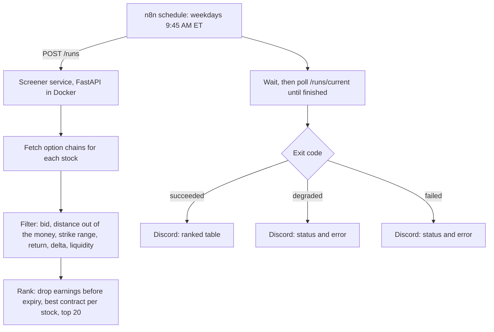

# S&P 500 daily put screener (Python + n8n)

A pipeline that screens about 500 S&P 500 stocks every weekday morning for cash-secured put candidates, and posts a ranked shortlist of up to 20 to a Discord channel.

Built for a private client, an individual investor who wanted a daily shortlist matching a set of rules. Shared with the client's permission.

**It screens only. It places no trades, and nothing here is investment advice.**

**Status:** live since August 2026, running at 9:45 AM ET on weekdays.

This repo is a showcase copy of the current code, without the commit history. Credentials and IDs in the n8n export are placeholders.

## What it does

## Reliability decisions

- One stock failing doesn't stop the run — it's logged and skipped, and results are saved after every stock
- Three outcomes, not two — succeeded, degraded and failed each get their own Discord message
- Preflight — the run checks its API key is set before it starts
- Secrets stay out — the service reads keys from the environment only, the Discord webhook lives in n8n's credential store, and error messages are scrubbed of secrets and file paths before they're sent
- Not reachable from outside — the service is exposed only to n8n on the same Docker network
- Run manifest — every run writes a record of what happened

## Settings

The screening rules are constants at the top of `chain-service/put_filters.py` and `chain-service/rank_shortlist.py` (distance out of the money, delta, minimum return, capital per position, liquidity, shortlist size). Change them to suit.

## Tests

346 automated tests (`cd chain-service && pytest`). One of them checks the git commit hash, so it needs the folder to be a git repo.

The tests include hand-worked reference values for the Black-Scholes calculations and an end-to-end test that follows a field from the screener through to the Discord output.

## Data sources

Option chains from Yahoo Finance (through `yfinance`), the stock list from SSGA's SPY holdings file, earnings dates from Finnhub (needs a free API key). `fixtures/` holds the stock list and the three saved option chains the tests run on.

## My role

I set the requirements with the client and made the decisions. Claude Code wrote the Python under my direction, with each plan reviewed before I approved it. I built the n8n schedule, the Discord delivery and the alerts by hand, and set up the server, Docker and firewall with step-by-step guidance.

## Files

- `chain-service/` — the pipeline, the API and the tests
- `n8n/workflow.json` — the n8n workflow
- `docker-compose.sidecar.example.yml` — how the service sits next to n8n
- `fixtures/` — saved data for the tests
